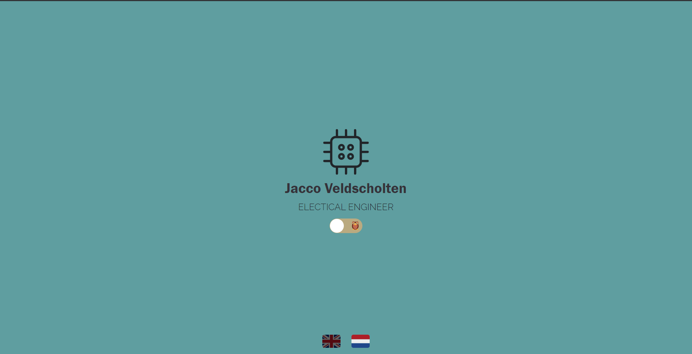

[](https://github.com/JaccoVeldscholten/Portfolio-React/actions/workflows/build-push.yml)
[](https://hub.docker.com/r/jjveldscholten/portfolio)


# Portfolio Jacco.Tech Written in React

This repository contains the portfolio for the https://jacco.tech website. The website is written in React and is based on Dorota's [template](https://github.com/Dorota1997/react-frontend-dev-portfolio).


An adjustment to the template is that it has been translated from React to Next.JS for SEO functionality.

## Example Dashboard


## Notes
- The current DockerFile is based on ARM Version of Node because of my Raspberry Pi K3S Cluster. 
To change this open the Dockerfile and change the following:

```bash
FROM arm32v7/node -> FROM node 
```
## Building & Running

Deploy the [docker container](https://hub.docker.com/r/jjveldscholten/portfolio) and proxy the port 3000

**Build Container**
```bash
docker build -t jjveldscholten/portfolio .
```
**Run Container**
```bash
docker run -it -p 3000:3000 --name portfolio jjveldscholten/portfolio
```

## Deployment 
For deploying under K3S/K8S use Kubectl and apply the following files
- Service.yaml
- Deploy.yaml


## Contributing
Pull requests are welcome. For major changes, please open an issue first to discuss what you would like to change.

Please make sure to update tests as appropriate.

## License
[MIT](https://choosealicense.com/licenses/mit/)